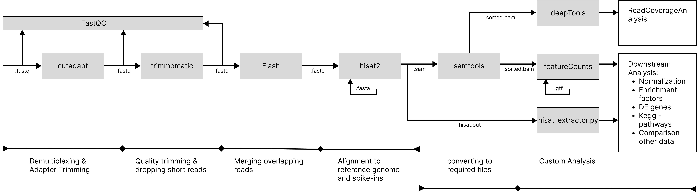

# Master Internship
On this page i will host all scripts i was using during my internship at Jäschke Lab. 

## Reproduce Software Environment
To reproduce the software used in this project use:

`conda env create -f environment.yml`

Note that standart anaconda or miniconda is required. 

## Software Workflow
The Software used and the different steps are illustrated in the figure below. For further information have a look in the methods part in the protocol.  
  

## Filestructure to make code work
For siplicity reasons each workstep takes an entire folder as input and outputs in another folder. For example cutadapt takes the data from *00_original_data* and puts the processed output in *01_trim5_demultiplexed_fastq*. This covers more storage but makes it more clearly aranged. I decided to do so because i can redo and start each processing step at each given point in the pipeline. For a final pipeline I recommend to automate evrything with pipes or a pipeline software.
The data from the sequencing facility was supplied as shown in Folder *00_original_data/unpacked*. Make sure to adapt the filestructure when reusing scripts.

/pfs/work7/workspace/scratch/hd_kg304-Helios_Hekcells_NADSeq  
├── 00_original_data  
│   ├── concatenated_fastq  
│   ├── **unpacked # orignial data**  
│   │   ├── Control  
│   │   │   ├── Control_Index  
│   │   │   │   ├── Control_S1_L001_I1_001.fastq.gz  
│   │   │   │   ├── Control_S1_L002_I1_001.fastq.gz  
│   │   │   │   ├── Control_S1_L003_I1_001.fastq.gz  
│   │   │   │   └── Control_S1_L004_I1_001.fastq.gz  
│   │   │   ├── Control_Read1  
│   │   │   │   ├── Control_S1_L001_R1_001.fastq  
│   │   │   │   ├── Control_S1_L002_R1_001.fastq  
│   │   │   │   ├── Control_S1_L003_R1_001.fastq  
│   │   │   │   ├── Control_S1_L004_R1_001.fastq  
│   │   │   └── Control_Read2  
│   │   │       ├── Control_S1_L001_R2_001.fastq  
│   │   │       ├── Control_S1_L002_R2_001.fastq  
│   │   │       ├── Control_S1_L003_R2_001.fastq  
│   │   │       ├── Control_S1_L004_R2_001.fastq  
│   │   ├── FK866  
│   │   │   └── ... (same structure as above)  
│   │   ├── NRH  
│   │   └── Rotenone  
│   └── YZ619.zip  
├── 01_trim5_demultiplexed_fastq  
├── 02_trimmed_fastq  
├── 03_merged_fastq  
├── 04_aligned_sequences  
│   ├── genome_alignment  
│   ├── forward_only_align  
│   ├── reverse_only_align  
│   └── spike_alignment  
│       ├── biotinRna  
│       ├── m7G122  
│       ├── m7G250  
│       ├── m7G400  
│       ├── nad102A  
│       ├── nad200  
│       ├── nad351  
│       ├── nad36  
│       ├── nad501  
│       ├── nad60  
│       ├── ppp102  
│       ├── ppp149  
│       ├── ppp301  
│       └── ppp51  
├── 05_count_matrices  
├── 10_alignment_data  
│   ├── gencode.v44.annotation.gtf  
│   ├── gencode.v44.chr_patch_hapl_scaff.annotation.gtf  
│   ├── GRCh38.p14.genome.fa  
│   └── HISAT_indexes  
│       ├── biotinRna  
│       ├── GRCh38.p14.genome  
│       ├── m7G122  
│       ├── m7G250  
│       ├── m7G400  
│       ├── nad102A  
│       ├── nad200  
│       ├── nad351  
│       ├── nad36  
│       ├── nad501  
│       ├── nad60  
│       ├── ppp102  
│       ├── ppp149  
│       ├── ppp301  
│       └── ppp51  
├── 11_scripts  
│   ├── build_index.sh  
│   ├── count_reads.sh  
│   ├── cutadapt_demultiplex.sh  
│   ├── extract_cat_data.sh  
│   ├── fastqc.sh  
│   ├── feature_Counts.sh  
│   ├── flash.sh  
│   ├── hisat2_forward_only.sh  
│   ├── hisat2_reverse_only.sh  
│   ├── hisat2.sh  
│   ├── hisat2_spikes.sh  
│   ├── hisat_extractor.py  
│   ├── sort_bams.sh  
│   ├── split_fasta.sh  
│   └── trimmomatic.sh  
├── 12_Slurm_reports  
│   ├── cutadapt_demultiplexing.22583880.out  
│   ├── cutadapt_demultiplexing.22584454.out  
│   ├── feature_counts.22586174.out  
│   ├── flash.22585291.out  
│   ├── forward_align.22679691.out  
│   ├── hisat2_spikeRNA_align.22588298.out  
│   ├── hisat2_spikeRNA_align.22590534.out  
│   ├── hisat_genome.22585324.out  
│   ├── reverse_align.22679693.out  
│   ├── samtools.22585699.out  
│   └── trimmomatic.22584887.out  
